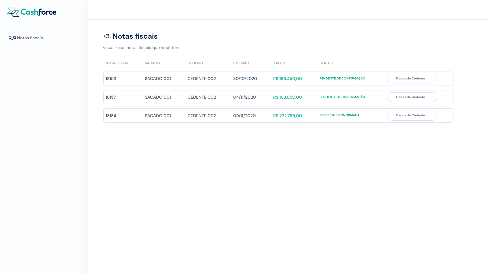

# Desafio Cashforce 💸



## Tecnologias

### Back-end

- Node.js
- TypeScript
- Express
- Mysql
- Sequelize
- Mocha, chai, sinon

### Front-end

- Vite + Vue
- TypeScript
- HTML
- CSS

## Executando o projeto

<details>
  <summary>
    Rodando o projeto com Docker 🐋
  </summary>

> ⚠️ Necessário a instalação do [Docker](https://docs.docker.com/engine/install/) e do [Docker Compose](https://docs.docker.com/compose/install/)

Clone o projeto e execute o script npm start na raiz do projeto

```bash
git clone git@github.com:GabrielFerrariR/Cashforce-desafio.git
cd /Cashforce-desafio
npm start
```

O npm start executa o compose que irá:
- Criar um container MySQL
- Executar o script .sql fornecido pela empresa.
- Iniciar um container node com a API em execução 
- Iniciar um container node com o client em execução no endereço [http://localhost:3000/](http://localhost:3000/), assim como a api está exposta na porta 3001. 

</details>

<details>
  <summary>
    Rodando o projeto na sua máquina
  </summary>
<br>

- Clone o projeto

```bash
git clone git@github.com:GabrielFerrariR/Cashforce-desafio.git
cd /Cashforce-desafio
```

- Execute o script do banco presente em /scripts (via CLI ou workbench, por exemplo)

- Altere o arquivo .env.example para receber as suas credenciais do MySQl e o renomeie para .env

- Inicie a API

```bash
cd /api
npm install
npm start
```

- Inicie o client

```bash
cd ../client
npm install
npm run dev
```

Se todo ocorreu como esperado, a aplicação estará rodando no endereço [http://localhost:3000/](http://localhost:3000/).

</details>
<br>

## Executando testes

Na pasta api:

```bash
npm test ## verifica os testes unitários
npm run test:coverage ## verifica a cobertura de testes
npm run test:integration ## verifica os testes de integração
```